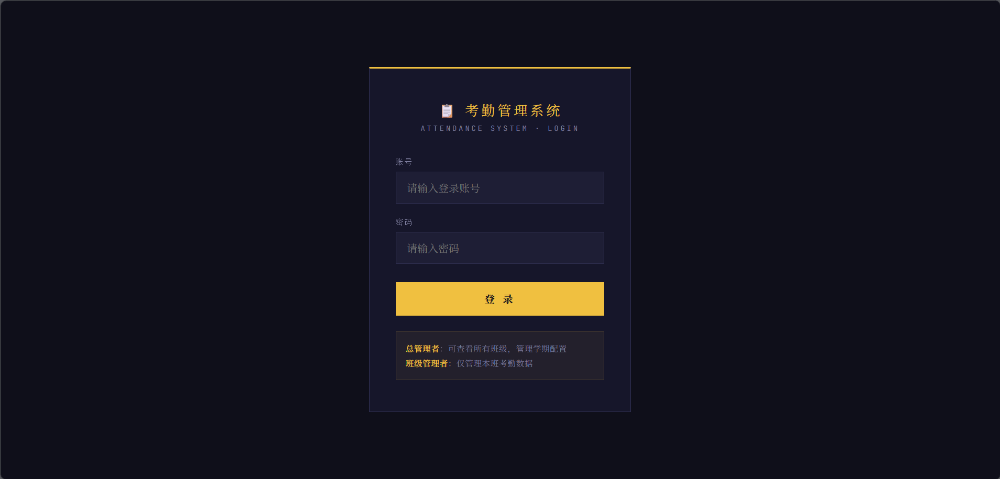
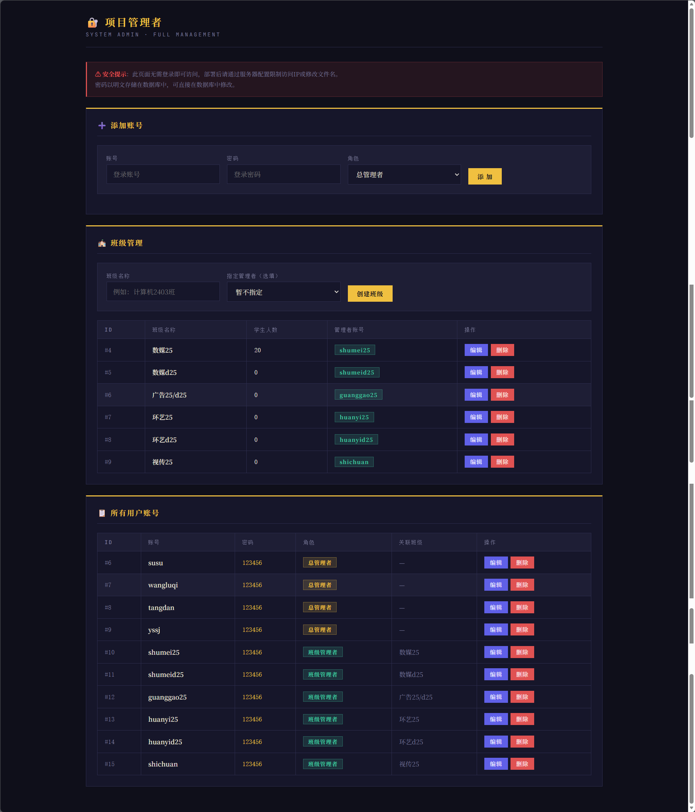
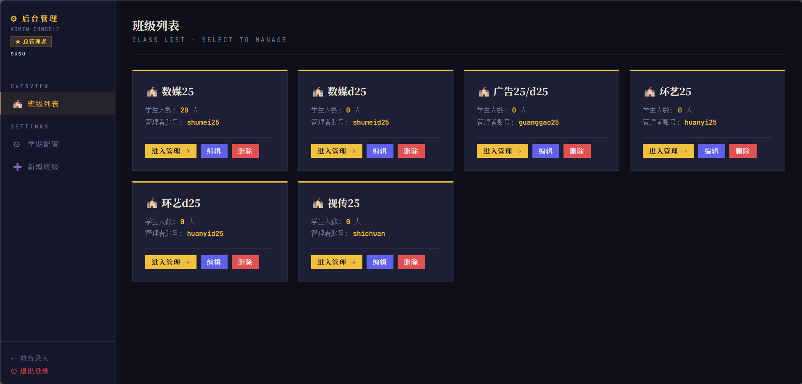
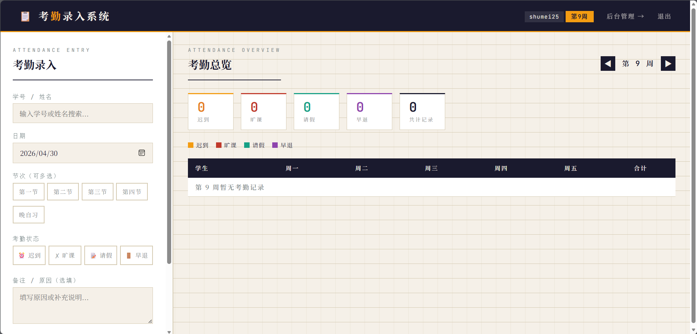
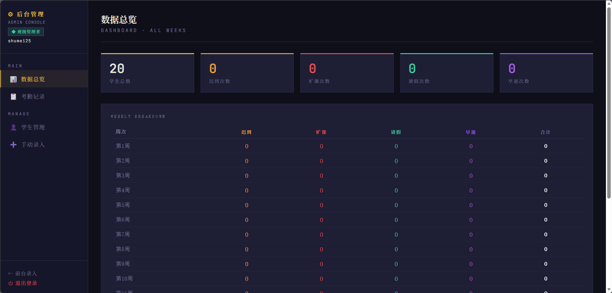
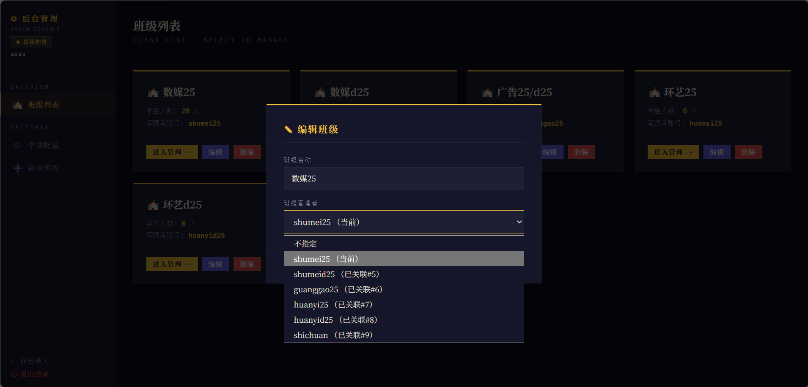
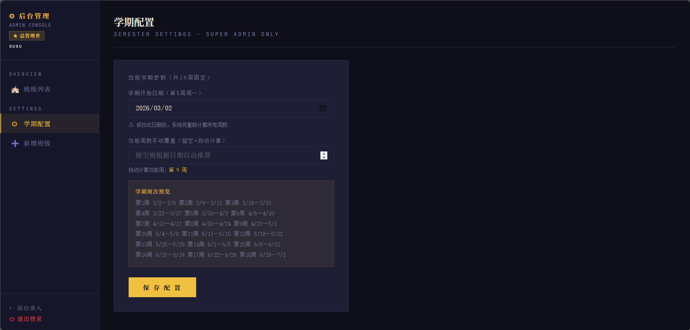

# 📋 考勤管理系统

> 轻量级校园考勤录入与管理平台，基于 PHP + MySQL，无前端框架依赖，开箱即用 🚀

## ✨ 功能特性

- 🔐 **多角色权限**：项目管理者 → 总管理者 → 班级管理者，分级授权
- 📝 **考勤录入**：支持迟到/旷课/请假/早退四种状态，可多选节次（第一节至第四节 + 晚自习）
- 📊 **周视图总览**：按周展示每位学生的考勤情况，标签含节次信息
- 🏫 **班级管理**：增删改班级、为班级指定管理者、批量导入导出学生（JSON）
- 👥 **账号管理**：项目管理者可管理所有用户账号密码（明文存储，方便数据库直接修改）
- 📅 **学期配置**：设置开学日期后自动推算当前周数，支持手动覆盖

## 🖼️ 界面截图

| 登录界面                    | 项目管理员后台                       |
| ----------------------- | ----------------------------- |
|  |  |
| `登录界面.png`              | `项目管理员后台.png`                 |

| 总管理员后台                      | 班级管理员前台                       |
| --------------------------- | ----------------------------- |
|  |  |
| `总管理员后台.png`                | `班级管理员前台.png`                 |

| 班级管理员后台                       | 编辑班级                    | 学期配置                    |
| ----------------------------- | ----------------------- | ----------------------- |
|  |  |  |
| `班级管理员后台.png`                 | `编辑班级.png`              | `学期配置.png`              |

## 👤 角色说明

| 角色       | 入口                          | 权限                        |
| -------- | --------------------------- | ------------------------- |
| 🏆 项目管理者 | `/tts.php`（无需登录）            | 管理所有账号密码、班级、班级负责人         |
| 🔶 总管理者  | `/login.php` → `/admin.php` | 查看所有班级、增删改班级、设置班级管理者、学期配置 |
| 🔷 班级管理者 | `/login.php` → `/index.php` | 仅管理自己班级的考勤和学生             |

## 🚀 快速部署

### 📦 环境要求

- PHP 7.4+（需 `mysqli`、`json` 扩展）
- MySQL 5.7+ / MariaDB 10.3+

### 🛠️ 安装步骤

1. 导入 `database.sql` 到 MySQL 数据库
2. 修改 `config.php` 中的数据库连接信息：
   ```php
   define('DB_HOST', 'localhost');
   define('DB_USER', 'root');
   define('DB_PASS', 'your_password');
   define('DB_NAME', 'your_database');
   ```
3. 将文件部署到 Web 服务器目录
4. 访问 `/tts.php` 添加账号和班级，或使用默认账号登录：
   - 总管理者：`college_admin` / `123456`
   - 班级管理者：`jsj2401` / `123456`

## 📁 文件结构

```
├── index.php            前台：考勤录入 + 周视图总览
├── admin.php           后台：数据管理、班级管理、学生导入导出
├── login.php           登录页面
├── tts.php             项目管理者页面（账号 + 班级管理）
├── api.php             后端 API，所有数据操作
├── config.php          数据库配置 + 工具函数
├── database.sql        建表脚本 + 示例数据
└── semester_config.json 学期配置（运行时自动生成）
```

## 🗄️ 数据库表

| 表            | 说明                           |
| ------------ | ---------------------------- |
| `classes`    | 班级信息                         |
| `users`      | 用户账号（密码明文，role 区分总管理者/班级管理者） |
| `students`   | 学生信息                         |
| `attendance` | 考勤记录（含 period 字段，支持按节次记录）    |

> ⚠️ 同一学生同一日期同一节次只能有一条记录（唯一约束）。

## 🔒 安全提示

- `/tts.php` 无需登录即可访问，部署后建议通过服务器配置限制访问 IP 或修改文件名
- 密码为明文存储，生产环境建议改用哈希加密
- 建议配置 HTTPS 和 `.htaccess` 限制敏感文件访问

## 🙏 致谢

本项目在开发过程中使用了 [Claude](https://claude.ai)和 [GLM-5.1](https://bigmodel.cn)辅助开发。

## 👨‍💻 作者

[TTS](https://www.ttscn.top)
